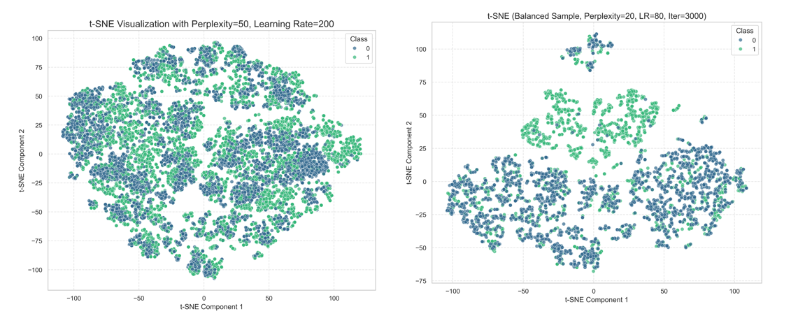
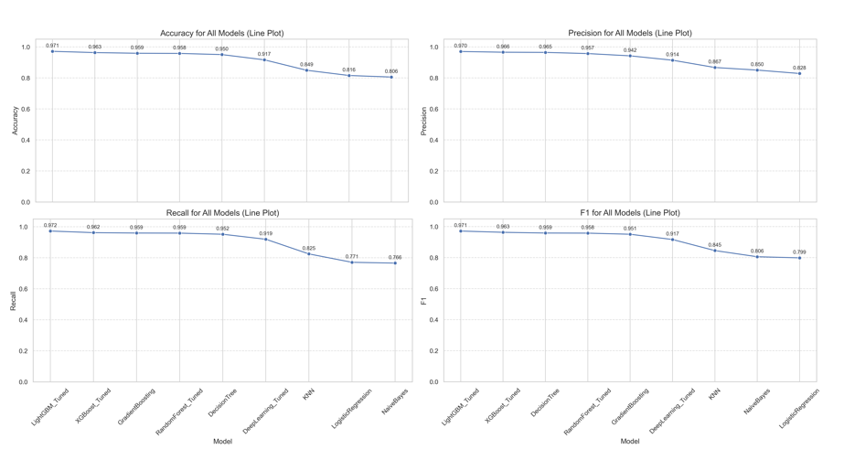
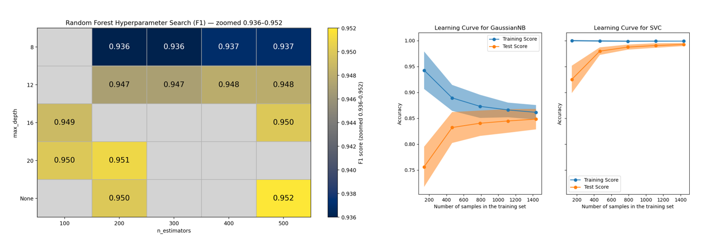

# Credit Card Fraud Detection using Machine Learning

An end-to-end machine learning project for detecting fraudulent credit card transactions using exploratory data analysis, imbalance handling, model comparison, hyperparameter tuning, leakage-safe evaluation, and SHAP explainability.

This project focuses on building an AI-based fraud detection system that can help financial institutions identify suspicious transactions, reduce financial losses, and minimise unnecessary inconvenience to genuine customers.

---

## Project Overview

Credit card fraud is a major problem in the financial industry. Fraudulent transactions are usually rare compared to legitimate transactions, which makes this a highly imbalanced binary classification problem.

The goal of this project is to classify each transaction as:

- `0` = Non-Fraudulent Transaction
- `1` = Fraudulent Transaction

The project follows a full data science workflow:

1. Exploratory Data Analysis  
2. Data preprocessing  
3. Class imbalance handling using SMOTE  
4. Model training and comparison  
5. Hyperparameter tuning  
6. Data leakage correction  
7. Model evaluation using fraud-relevant metrics  
8. SHAP explainability  
9. Business interpretation  

---

## Dataset Imbalance

The dataset is highly imbalanced, with fraudulent transactions forming only a very small percentage of the total transactions.

Only around **0.5%** of the transactions are fraudulent, while around **99.5%** are non-fraudulent. This means that accuracy alone is not a reliable metric because a model can achieve high accuracy by simply predicting most transactions as non-fraudulent.

Because of this, the project focuses more on:

- Recall
- Precision
- F1-score
- ROC-AUC
- PR-AUC
- Confusion matrix analysis

---

## Exploratory Data Analysis

Exploratory Data Analysis was performed to understand how fraudulent and non-fraudulent transactions differ across customer and transaction features.

### Age and Location Patterns

The age distribution shows that fraud risk varies across customer age groups. The location map also shows that fraud cases are not randomly distributed, but appear in certain geographic clusters.

This suggests that customer profile and location-related features can provide useful fraud detection signals.

Key EDA insights:

- Fraudulent behaviour is not completely random
- Customer age can be a useful feature
- Location patterns may indicate fraud hotspots
- Fraud detection benefits from combining transaction, demographic, and geographic features

---

## Handling Class Imbalance using SMOTE

Since fraud cases are extremely rare, the model may become biased toward predicting non-fraudulent transactions.

To address this, SMOTE was used to generate synthetic fraud samples for the training data.

After SMOTE, the training dataset becomes balanced with:

- 50% fraudulent transactions
- 50% non-fraudulent transactions

Important note:

> SMOTE is applied only to the training data, not the test data. This prevents data leakage and ensures that evaluation reflects real-world performance.

---

## t-SNE Visualisation

t-SNE was used to visualise the structure of the dataset before and after balancing.

The visualisation helps show whether fraudulent and non-fraudulent transactions form meaningful clusters. After balancing, the local separation between classes becomes clearer, which helps the model learn more meaningful decision boundaries.

---

## Model Comparison

Multiple machine learning models were trained and compared.

The models include:

- Logistic Regression
- Naive Bayes
- K-Nearest Neighbours
- Decision Tree
- Random Forest
- Gradient Boosting
- XGBoost
- LightGBM
- Deep Learning model

The models were compared using accuracy, precision, recall, and F1-score.

For fraud detection, accuracy is not enough because the dataset is highly imbalanced. A strong model must be able to catch fraud cases while avoiding too many false alarms.

Key metric meanings:

| Metric | Meaning |
|---|---|
| Accuracy | Overall correct predictions |
| Precision | Out of predicted fraud cases, how many were actually fraud |
| Recall | Out of actual fraud cases, how many were correctly detected |
| F1-score | Balance between precision and recall |
| ROC-AUC | Ability to separate fraud and non-fraud classes |
| PR-AUC | More useful than ROC-AUC for imbalanced fraud detection |

---

## Hyperparameter Tuning and Learning Curves

Hyperparameter tuning was performed to improve model performance and generalisation.

The Random Forest heatmap shows how different combinations of `n_estimators` and `max_depth` affect F1-score.

Learning curves were also used to check whether the model was overfitting or generalising well. A small gap between training and validation performance suggests that the model is learning useful fraud patterns rather than memorising noise.

---

## Data Leakage Prevention

One major issue identified during evaluation was possible data leakage from applying resampling before splitting the dataset.

The corrected pipeline uses strict isolation:

1. Start with the original dataset  
2. Perform train-test split first  
3. Apply SMOTE only on the training set  
4. Keep the test set untouched  
5. Evaluate on unseen test data  

This prevents the model from indirectly seeing test data during training.

This step is important because data leakage can inflate model performance and make the model appear better than it actually is.

---

## ROC and Precision-Recall Evaluation

The model was evaluated using ROC and Precision-Recall curves.

ROC-AUC shows how well the model separates fraudulent and non-fraudulent transactions overall.

However, for fraud detection, the Precision-Recall curve is especially important because fraud cases are rare. PR-AUC gives a better view of performance on the minority fraud class.

---

## Confusion Matrix Analysis

Confusion matrices were used to compare model performance across different algorithms.

The confusion matrix helps identify:

- True Positives: fraud correctly detected
- True Negatives: legitimate transactions correctly classified
- False Positives: legitimate transactions wrongly flagged as fraud
- False Negatives: fraud cases missed by the model

For fraud detection, false negatives are especially dangerous because they represent fraud cases that were not caught.

At the same time, false positives must also be controlled because too many false alarms can inconvenience genuine customers.

---

## SHAP Explainability

Model explainability is important in fraud detection because banks and stakeholders need to understand why a transaction is flagged as suspicious.

SHAP was used to interpret the model’s predictions.

### SHAP Feature Importance

The SHAP feature importance plot shows that the most influential fraud detection features include:

- Transaction amount
- Transaction hour
- Transaction category
- Customer age
- City population
- Gender
- Day of week
- Location-related features

Transaction amount is the most important feature, meaning it has the strongest average impact on the model’s fraud predictions.

---

### SHAP Dependence Plot

The SHAP dependence plot shows how transaction amount affects the model’s prediction. It also shows how transaction hour interacts with transaction amount.

This helps explain not only which features matter, but also how feature values push the model toward fraud or non-fraud predictions.

---

## Key Findings

The project produced several important findings:

- Fraud cases are extremely rare, so class imbalance must be handled carefully
- Accuracy alone is not suitable for fraud detection
- SMOTE helps the model learn minority fraud patterns
- LightGBM and XGBoost perform strongly on structured tabular fraud data
- Tree-based models outperform the neural network baseline in this project
- SHAP improves transparency by explaining model decisions
- Leakage-safe evaluation is necessary for realistic model performance
- Business value depends on balancing fraud capture with customer experience

---

## Business Value

A fraud detection system must not only perform well technically, but also support real business goals.

This project supports:

- Faster fraud detection
- Reduced financial losses
- Fewer false alarms
- Better fraud investigation support
- More transparent AI decision-making
- Human-in-the-loop review for high-risk cases

The model can be used as a decision-support tool to flag suspicious transactions for further investigation.

---

## Tech Stack

The project uses:

- Python
- Pandas
- NumPy
- Scikit-learn
- Imbalanced-learn
- XGBoost
- LightGBM
- CatBoost
- SHAP
- Matplotlib
- Seaborn
- Streamlit / FastAPI for future deployment

---

## Future Improvements

Possible future improvements include:

- Build a Streamlit dashboard for real-time fraud prediction
- Deploy the model using FastAPI
- Add model monitoring for data drift
- Add transaction-level SHAP explanations
- Tune classification thresholds based on business cost
- Add real-time alerting for high-risk transactions
- Include more behavioural and location-based features

---

## Conclusion

This project demonstrates an end-to-end fraud detection workflow using machine learning and explainable AI.

The key lesson is that fraud detection is not just about achieving high accuracy. A reliable fraud detection system must handle class imbalance, avoid data leakage, use appropriate metrics, explain its predictions, and balance fraud capture with customer experience.

The final framework provides a strong foundation for a transparent and business-aware fraud detection system.
